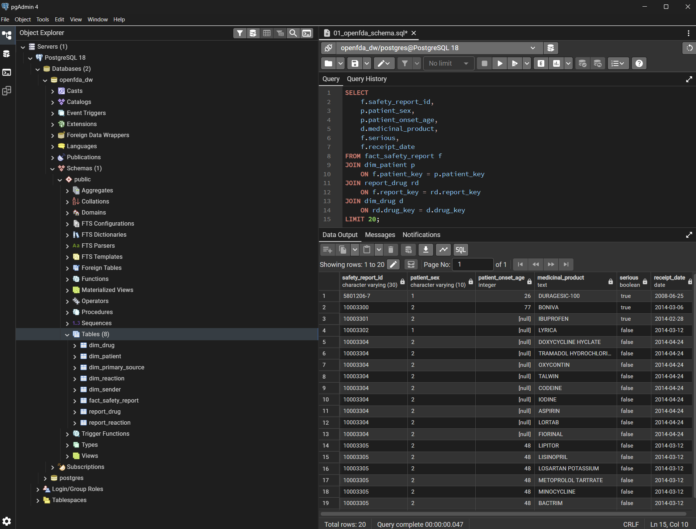
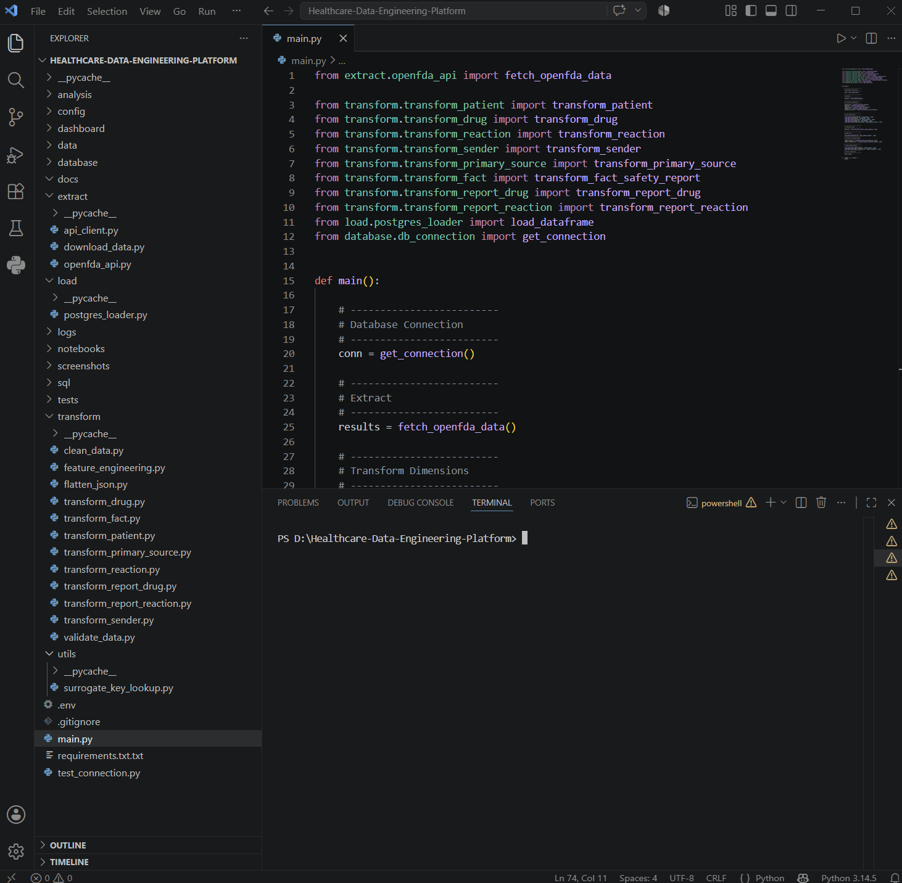
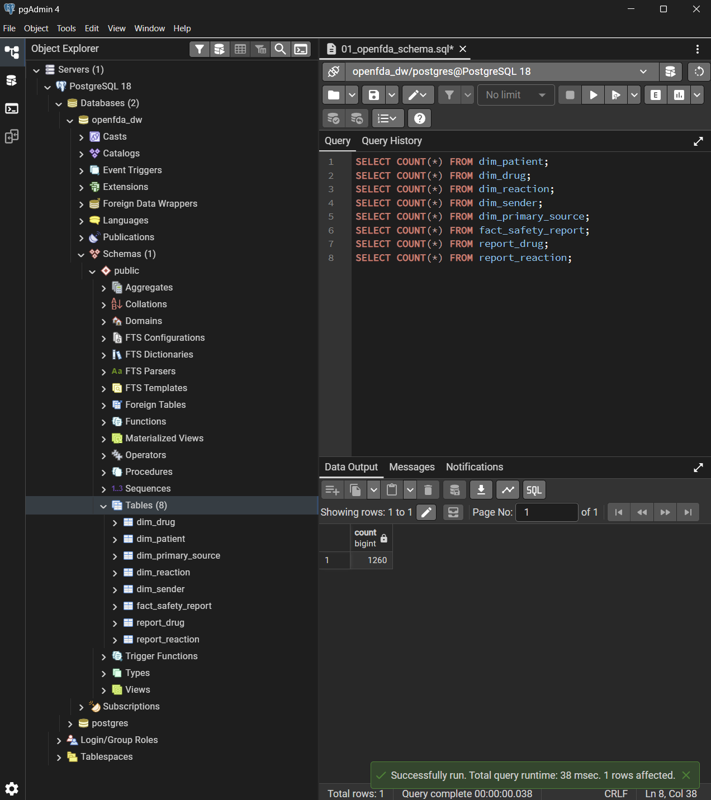
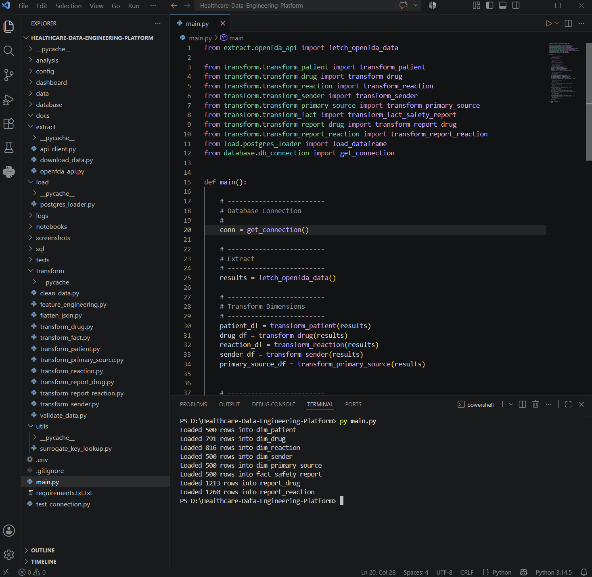
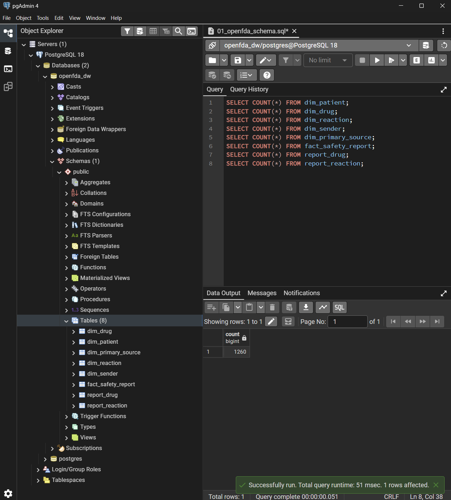
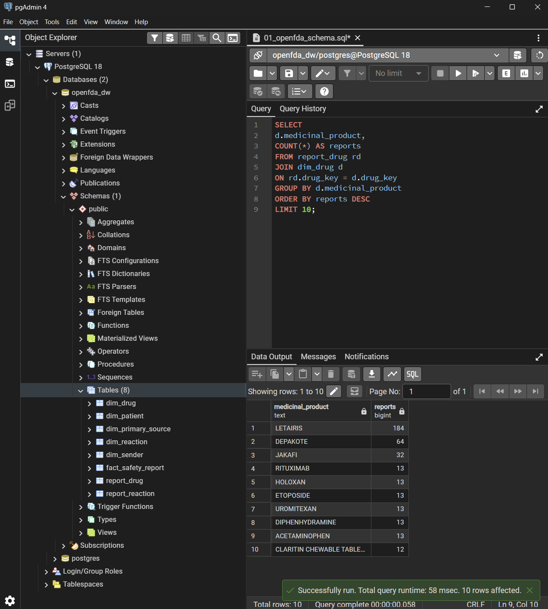
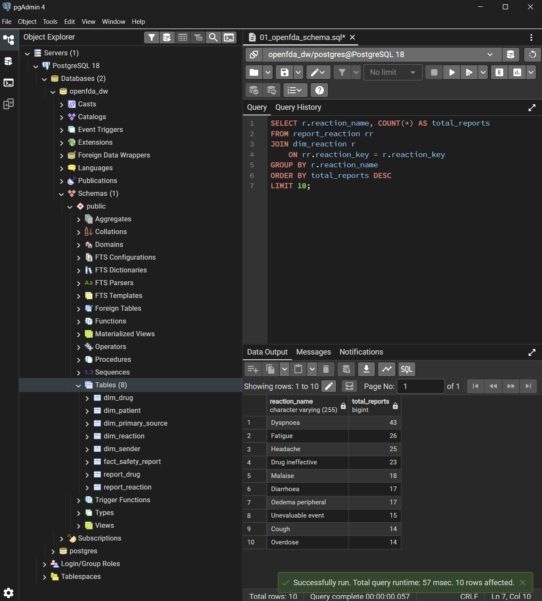

# 🏥 Healthcare Data Engineering Platform

An end-to-end Data Engineering project that extracts adverse drug event data from the OpenFDA API, transforms raw JSON into a dimensional PostgreSQL data warehouse, and enables analytical reporting through SQL.

---

## 📌 Project Overview

The OpenFDA Drug Event API provides adverse drug event reports submitted to the U.S. Food and Drug Administration.

This project builds a complete ETL pipeline that:

- Extracts adverse event data from the OpenFDA REST API
- Cleans and transforms nested JSON into relational tables
- Implements a dimensional data warehouse using PostgreSQL
- Uses surrogate keys for efficient joins
- Resolves many-to-many relationships using bridge tables
- Supports analytical SQL queries for reporting and insights

---

## 🛠 Tech Stack

- Python
- PostgreSQL
- Pandas
- NumPy
- Requests
- psycopg2
- SQL

---

## 🏗️ Architecture

OpenFDA REST API
        │
        ▼
Python ETL Pipeline
(Extract → Transform → Load)
        │
        ▼
PostgreSQL Data Warehouse
        │
        ▼
SQL Analysis

---

## ⚙️ ETL Workflow

The ETL pipeline follows these steps:

1. Extract adverse drug event data from the OpenFDA REST API.
2. Transform nested JSON into structured relational tables.
3. Clean and standardize missing or inconsistent values.
4. Populate dimension tables.
5. Generate surrogate keys for efficient joins.
6. Load the fact table.
7. Populate bridge tables for many-to-many relationships.
8. Validate data quality using SQL queries.

---

## 📊 Data Warehouse Design

The project uses a Star Schema with Bridge Tables.

### Fact Table

- fact_safety_report

### Dimension Tables

- dim_patient
- dim_sender
- dim_primary_source
- dim_drug
- dim_reaction

### Bridge Tables

- report_drug
- report_reaction

Bridge tables resolve the many-to-many relationships between safety reports and reported drugs/reactions while maintaining one row per safety report in the fact table.

---

## 📂 Project Structure

Healthcare-Data-Engineering-Platform/
│
├── extract/
├── transform/
├── load/
├── database/
├── utils/
├── docs/
│   └── screenshots/
├── main.py
├── requirements.txt
└── README.md

---

## ✨ Features

- REST API Data Extraction
- Modular Python ETL Pipeline
- PostgreSQL Data Warehouse
- Star Schema Design
- Surrogate Keys
- Bridge Tables
- SQL Analytics
- Data Quality Validation

---

## 📈 SQL Analysis

### Top Reported Drugs


### Top Reported Reactions


### Drug Report Analysis



### Adverse Reaction Analysis


---

## ▶️ How to Run

1. Clone the repository.
2. Create a Python virtual environment.
3. Install dependencies.

```bash
pip install -r requirements.txt
```

4. Configure your PostgreSQL connection.
5. Execute the ETL pipeline.

```bash
python main.py
```

---

## 🚀 Future Improvements

- Automate the ETL pipeline using Apache Airflow
- Implement incremental data loading
- Containerize the project with Docker
- Build a Power BI dashboard
- Deploy the solution on AWS or Azure

---

## 📸 Project Screenshots

### Project Structure



### Database Tables



### Successful ETL Execution



### Data Loading Summary



### Top Reported Drugs



### Top Reported Reactions



### Data Quality Validation


### Drug Report Analysis


### Adverse Reaction Analysis


### Data Warehouse Schema


